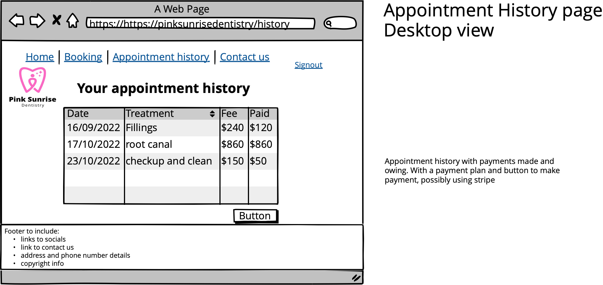
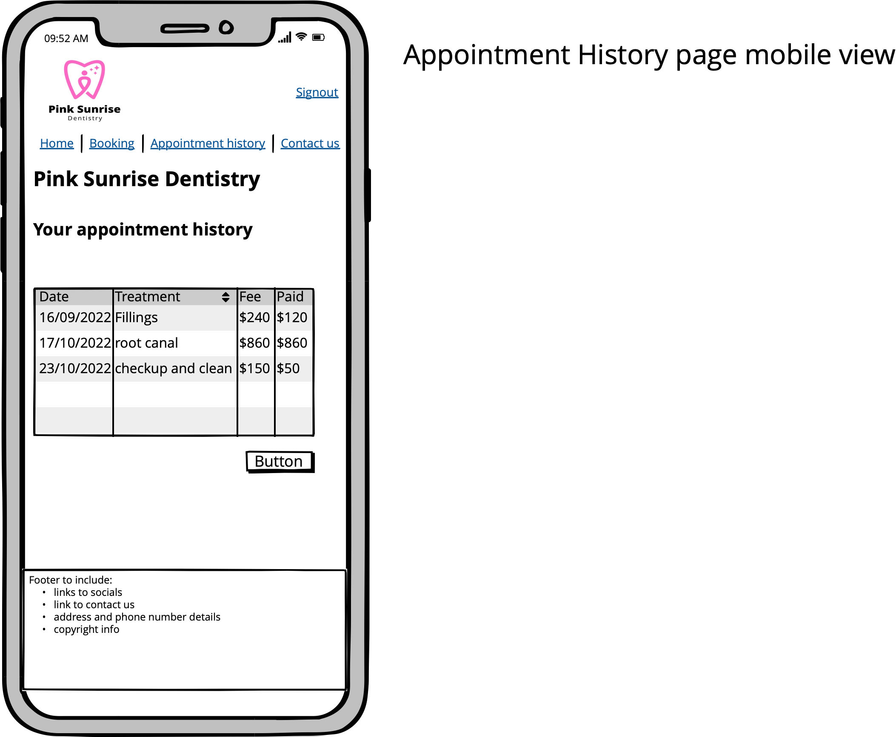
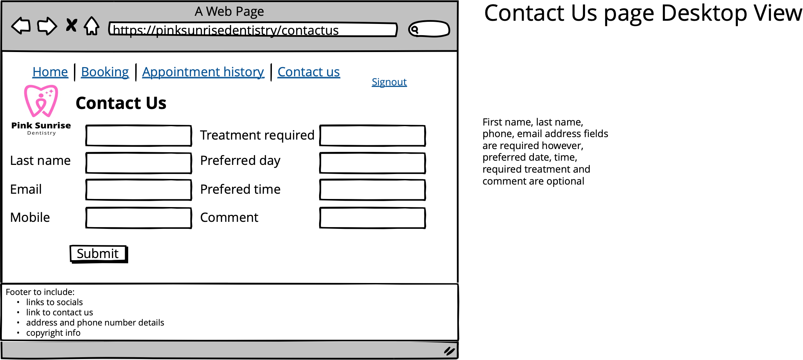
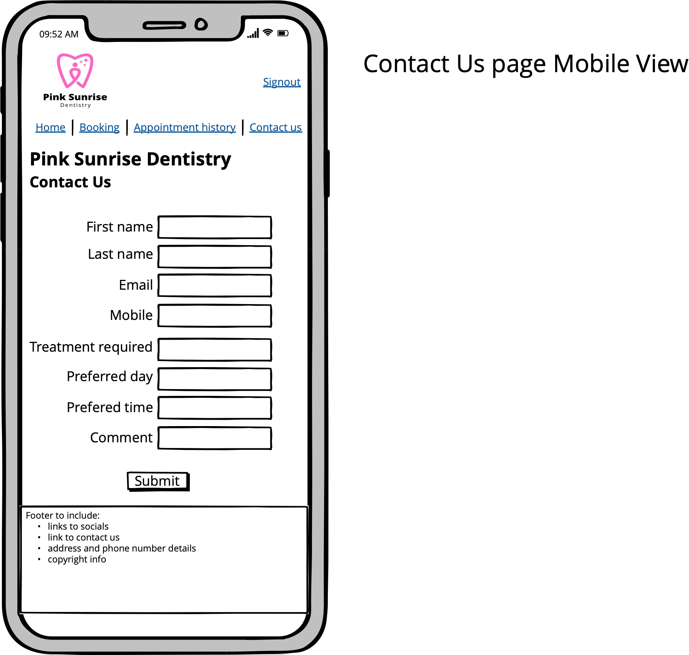
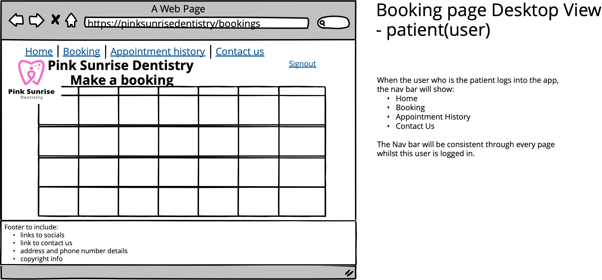
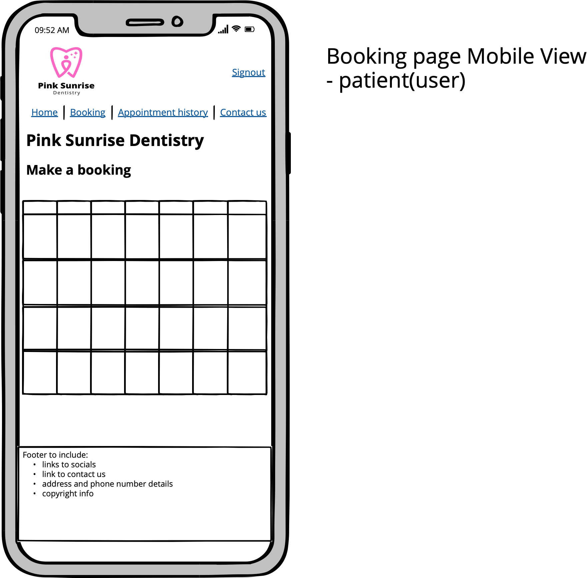
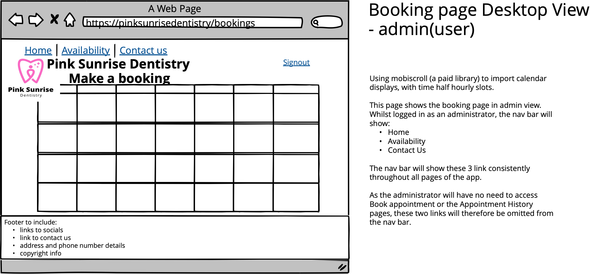

# # **Pink Sunrise Dentistry Documentation**

## **By Leith Price and Hardeep Singh**

Useful links:
- [Documentation](https://github.com/HardeepSinghAu/pink-sunrise-dentistry-documentation)
- [Pink Sunrise Dentistry Front-end repository](https://github.com/HardeepSinghAu/pink-sunrise-dentistry)
- [Pink Sunrise Dentistry Back-end repository](https://github.com/LeithPrice/pink-sunrise-dentistry-api)
- [www.pink-sunrise-dentistry.com]()
- [Trello Board](https://trello.com/b/GTJg7qxU/dentist-booking-system-website) as well as a directory of daily screenshots.

### **Purpose**

The client, requested an app that would allow current and new patients to book their appointments as well as allow the Dentist (from here referred to as the Doctor)to register his availability through a dashboard. The client also wamted the Administrator to have special permissions to create users and to create Doctor Users who would then be able to update their schedules on the app.

The main purpose of this app is to promote Pink Sunrise Dentistrys online presence and reach a wider audience through a professional and secure app. Secondly and just as essentially, increase patient bookings and boost patient numbers by providing an online booking portal. This will streamline the booking process, giving staff more time to focus on other tasks and patients more control over their schedules.

The client also needed the app to convey detailed information regarding the Clinics services such as treatments and sell the clinics modern and family friendly ethos.
***
### **Target Audience**

The app for Pink Sunrise Dentistry is targetting at adults aged 18 and above, to book appointment to meet their dental needs. Parents and guardians are also able to use the app to book appointments for their children.
***
### **Functionality & Features**

The app will have three types of users, Patients, Doctor and Admin. 
- All users, Patient, Doctor and Admin, will habe the ability to login in using the same login page.
- Patient users will be able to register to create a patient account only.

When a Patient User is logged in they can complete the following operations:
- Use the booking system to search for and select an appointment date and time.
- Look up their appointment and billing history.
- Click on a payment button linking them, the patient to payment options.
- Patient Users can only view their own history.
- Delete or update their appointment bookings.

When an Adminstrator logs in they can complete the following operations:
- View an Admin dahsboard to allow them to list the availibility of the Doctor.
- Create other Users, Patients or Doctors, therefore allowing Doctor Users to have the required permissions to create appointments by selecting their availibility.
- View Bookings filled.
- View a summary of Booking totals.

When a Doctor User is logged in they can complete the following operations:
- Update their availability, therefore creating available appointments for the Patient User to select.
- View booked appointments.

***
### **Wireframes for multiple standard screen sizes**
  

***

### **User Stories**

“As a [persona], I [want to], [so that].”

1. As a busy person, I am always on the go. I don't want to call my dentist and have to wait on hold to talk to someone to book. I want to be able to go online and book at the click of a button and get on with my day.

2. As the Office Manager, I have a lot of admin, booking fees to process, patients to manage. Sometimes the phone is ringing off the hook with people who want to book an appointment. It would take a load off my plate to be able to have patients book themselves in so that I can get on with other tasks, such as taking care of the patients in the clinic.

3. As someone who has a hectic schedule, I like to be able to see which appointments are available and book in the one that best suits my schedule. Being able to book my dentist appointment on line, would definitely help me in doing that.

4. I'm a very anxious person and dislike getting on the phone to make appointments, being able to do this online without having to interact with another person will help me massively with being able to access a dentist and keeping on top of my dental health. Now if only I could do that without interacting with the dentist!

5. As a Mum of three, I regularly book the Dental appointments for my family and I. It would be handy to be able to access a history of treatments so that I can keep track of when a family member last visited so I can book them in after 6 month intervals.

6. I have a lot of dental work done due to a health issue, sometimes it's a challenge to keep track of it all with my other medical expenses and needs. It would be invaluable to me, to be able to see my treatment history and what is owed so that I can budget and plan to pay back the balance in due course.

7. As a small business owner, I can't afford the time to wait on hold for 20 mins to speak to the receptionist to do something as simple as lock in an appointment. In this day and age, this should really be an effortless online process.

8. As a University student, I am always on the go, busy with uni, work and catching up with friends. I dont want to wait on the phone to book an appointment. I should be able to see all the times available online and be select what fits around my plans.

9. I have just turned 18 and am taking charge of booking my own medical appointments. I'm surprised the clinic isn't aready online and is quite a turn off using it as its inconvenient. However, I am familiar with the clinic and would prefer to use them if they can start taking online appointments. In this day and age, everything should be streamlined online.

10. I am a Dentist who works at the clinic, it would be good to have a central system we can all access and update easily. Rather than have to tell the Adminstrator of my availibility on a weekly basis, I should be able to login in easily and securely to update the days I am in the clinic and also view my bookings for the day or week ahead.

**Follow up market Research**

1. As a Patient using this website, it would be handy to receive and email or text confirming the appointment to know that yes it has indeed been booked.

2. As the Administrator, it would be handy to have a feature which automatically sends the Patients an email or text reminder, the day before their appointment. This way I wouldn't have to call around to remind people, which is a task I can't always complete, so sometimes people don't remember their appointments and miss them.

3. As a Denstist, I am enjoying using this app. An additional feature could be an inclusion of the treatment the patient is coming in for but this isn't necessary as our Medical Database holds this information.  

**Feedback from consultation with the Client**

1. As the administrator, it would be nice to be able to add an update alert of news at the clinic, such as new treatments we may have started offering or any discounted treatments and other news.

2.

***
### **Tech Stack**

**Front-end**
- HTML
- CSS 
- REACT.JS
- Javascript
- JSX

**Back-end**
- Ruby
- Ruby on Rails

**Database**
- PostgreSQL

**Deployment**
- Netlify for front-end
- Heroku for back-end

**Testing** 
- RESTful Client

**Project-management tools**
- Trello
- Discord

**Utilities** 
- Balsamiq
- [Lucid Chart](https://www.lucidchart.com/pages/)

**DevOps:**
- Git and Github
- VS Code
***
### **Dataflow Diagram**
***
### **Application Architecture Diagram**
***

> "Teamwork makes the dreamwork"

### **Scrums & Sprints**

When we set about this project, we had a very clear idea of the features this project should entail, a booking system for the client who is a Dentist currently with a very small online presence. The app needed to include features that allowed Patient Users to login and book an appointment online effortlessly. Additionally, we needed to include a contact form so that they could contact the Clinic and ask questions about more complex treatments.

We started off with a Scrum where we discussed the features of the projects and what we would need to create overall. We also discussed the tech stack we preferred to use and how it would be more beneficial to the project over any other tech stack either of us were familiar with. We decided to hold a daily stand-up to ensure we both had a plan of attack for the day and were on same page. At the end of each week we also conducted a sprint demo to share our achievements and then moved on to sprint planning to determine which tasks to execute in the upcoming sprint. We also did a short daily review and noted these down on a daily Trello column of key tasks that we completed that day, tasks that went well, things that hadn't gone well.

### **Trello Board for Project Management and task Delegation**

We created a Trello Board and broke the project down into smaller tasks and listed them as cards under two backlog categories, one for documentation and one for coding. We then created a further two columns titled Leith and Hardeep, where we would place tasks being managed by the respective team member. Lastly we had daily columns for completed tasks to move the cards into once those tasks had been fully completed.

We chose to use Trello as it was a tool we were both familar with and felt it would be a good way to delegate the tasks, visually keep track of our own tasks, see what our team mate was working on as well as keep track of the tasks listed in the two backlogs. Overall a useful tool for task delegation and visual communication.

Our live Trello Board can be found [here](https://trello.com/b/GTJg7qxU/dentist-booking-system-website) as well as a directory of daily screenshots included in this repository.

| Sprint Number | Week | Focus | Deadlines|
|---|---|---|---|
| **1** | 17/10/2022 to 23/10/2022 | Documentation, wireframes, ERD and prepare the 3 framework for 2 of the 3 repos we would need to use (documntation and front-end framework), research on how to structure calender UI| |
| **2** | 24/10/2022 to 30/10/2022 | Rails back-end up. Create Login/Register and Logout function. RESTful client testing. Ensure documentation is as complete as it can be, dataflow and architecture diagram completed. Start on React components. Deploy! | |
| **3** | 31/10/2022 to 06/11/2022 | Continue Testing. Start working on presentation. Ensure documentation is complete and ready to go. | Documentation due to client 06/11/2022 |
| **4** | 07/10/2022 to 13/11/2022 | Testing is key this week and should be completed (90% test coverage is required by the client). Work on the Front-end needs to be completed if it hasn't already, this will be the focus of the week. Styling. | |
| **5** | 14/10/2022 to 20/11/2022 | Ask client to test the finished app. Addition of any sprinkles if all key tasks, functions and features have been implemented. | |
| **6** | 21/10/2022 to 23/11/2022 | Complete project. | Project due to be completed in full by the 23/11/2022 |

### **Discord**
We are  familiar with each others working style and dedication to the project. As we both use discord as a primary mean of communication with one another we decided to continue using discord to discuss and work on the project. We used Discord to communicate with each other regularly throughout the day. Here we discussed the tasks we were working on, ask for assistance, as well as ask one another queries and clarifications to ensure we were on the same page.

We decided that instead of delegating tasks to one another we would volunteer for tasks that we felt confident in being able to complete successfully. Leith took on the mammoth and key task of getting the rails backend up and running, a task he felt confident in as he had already put this into practice. He also felt it was important for him to map out the ERD so that he had a good understanding of the tables he needed to create for the backend. The tables we would use and relationships between them, were discussed at length between us before Leith used [Lucid Chart](https://www.lucidchart.com/pages/) to create an ERD.

I (Hardeep) decided to make a dent in the documentation as the client had requested this at an earlier date and having a good understanding of markdown and the requirments for the document, I decided to intilly focus on that (current document). Furthermore, I had recently taken part in a hackthon using React and enjoyed creating components I also decided to intialise a repo connected to a directory with the framework for the front-end and create a few simple Components such as the a Navbar and the Footer and crafting the start of the pages we will need such a home page and About Us page.

Leith also completed the Application Architecture Diagram and the Dataflow Diagram as he had a subscription to Lucid Chart and a better understanding of the flow of Data.

#AS THE WEEKS GO ON WE SHOULD DISCUSS MORE TASKS WE COMPLETED AND WHY EACH TEAM MEMBER TOOK THAT TASK....because reasons

### **Screenshots of Trello Board**

A directory containing screenshots of our Trello board can be found in this repository. It contains daily screenshots from the start of the day to the end of the day throughout this project.

